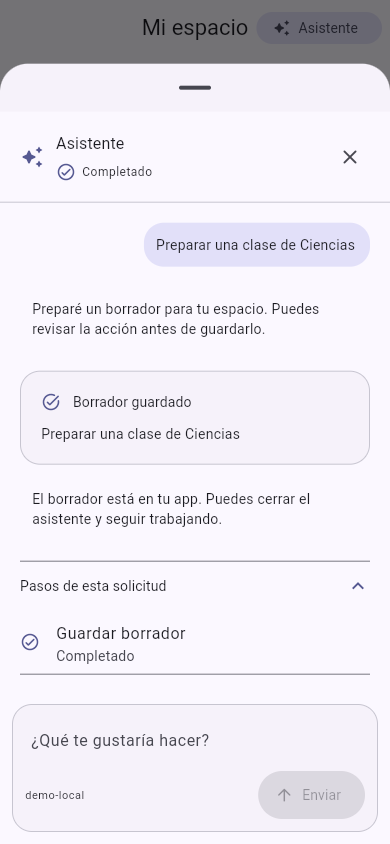

# asystant-ai

SDK Flutter para incorporar un asistente **dentro de una app existente**. Se abre desde un botón y puede vivir en una sección, bottom sheet, end drawer o pantalla completa. El nombre visible es configurable; por defecto, **Asistente**.

## Estructura

| Directorio | Responsabilidad |
| --- | --- |
| `packages/asystant_ai` | Widgets, genUI, permisos, tema, textos y ViewModel con reactive_notifier |
| `packages/asystant_core` | Contratos Dart, tools tipadas, transporte y sesión |
| `services/asystant_gateway` | API Rust/Actix + PostgreSQL/Diesel, credenciales temporales y presupuestos |
| `examples/host_app` | App con un espacio de trabajo y una tool local real para crear borradores en memoria |

Las tools se ejecutan exclusivamente en la app y llaman sus servicios habituales. El gateway transmite sus esquemas al modelo; nunca ejecuta código del producto. No requiere MCP.

## Ver la app

```sh
flutter pub get
cd examples/host_app
flutter run -d chrome
```

La demo usa respuestas simuladas y lo indica en pantalla. Las acciones sobre los borradores sí se ejecutan mediante el mismo ciclo de herramientas y permisos que usa el SDK con un proveedor real.



## Integración

```dart
import 'package:asystant_ai/asystant_ai.dart';

class MyAssistant extends AsystantAI {
  MyAssistant() : super(name: 'Aula-AI');

  @override
  List<AsystantTool> get tools => [CreateDraftTool()]; // Tool de tu app.

  @override
  List<AsystantSystemPrompt> get systemPrompts => const [
    AsystantSystemPrompt(id: 'role', content: 'Ayuda dentro de esta app.'),
  ];
}

// Después de preparar los servicios y comprobar la sesión del host:
final assistant = MyAssistant();
await assistant.init(
  transport: GatewayTransport(baseUri: gatewayUri, sessionSource: hostSession),
  // models es opcional: la API asigna el modelo por cliente.
  models: [],
  builtInTools: const [
    PresentationTool(kind: AssistantCardKind.summary),
    PresentationTool(kind: AssistantCardKind.selection),
  ],
);

// Desde cualquier sección del host:
AsystantButton(assistant: assistant);

// O dentro de un contenedor con altura delimitada / endDrawer / Scaffold:
AsystantChat(assistant: assistant);
```

La instancia pertenece a la app: cerrar el panel conserva la conversación. Llama `dispose()` cuando dejes de necesitarla. Dos instancias mantienen estado independiente. Un cambio de identidad invalida permisos pendientes y limpia el historial; después el host vuelve a llamar `init`.

- [Cobertura de funcionalidades acordadas](docs/feature-coverage.md)
- [API pública y tools](docs/public-api.md)
- [Autenticación, límites y arranque del gateway](services/asystant_gateway/README.md)
- [Despliegue de la API con Docker](docs/deployment.md)
- [Arquitectura y decisiones](docs/proposal.md)
- [Interacción y personalización](docs/interaction-design.md)
- [Verificación y límites actuales](docs/implementation-verification.md)
- [Evidencia revisada en AulaMás](docs/aulamas-reference.md)

Versión inicial privada. No se ha publicado en pub.dev ni desplegado. La prueba con OpenRouter real encontró una credencial en el entorno, pero el proveedor la rechazó con HTTP 401; queda pendiente repetirla con una clave válida. Ninguna clave de proveedor se incluye en Flutter. Los antiguos archivos `liria-preview*` son prototipos históricos y no forman parte de la librería.
