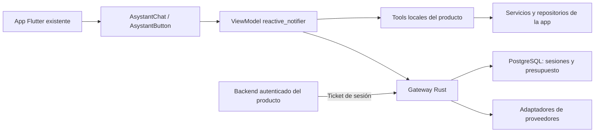

# Arquitectura de asystant-ai

Nombre elegido por el usuario: **asystant-ai**. Paquetes Dart: `asystant_ai` y `asystant_core`. API: `AsystantAI`, `AsystantTool`, `AsystantSystemPrompt`, `AsystantChat`, `AsystantButton`. La marca de la librería y el nombre que ve el usuario son independientes.

El SDK no crea un login paralelo, router propio ni shell de aplicación. El mismo chat se monta en una sección o se abre desde un botón. El host conserva la instancia y decide cuándo inicializarla y liberarla.

`asystant_core` contiene contratos Dart puros, registro, validación de argumentos y transporte. `asystant_ai` añade modelos de presentación, servicio mixin por instancia, ViewModel sin inyección por constructor y widgets. Los recursos visuales de ciclo de vida —controladores de texto y scroll— pertenecen a los widgets; conversación, borrador, permisos y efectos pertenecen al ViewModel.

El servicio de cada instancia posee su `ReactiveNotifierViewModel`. Se verificó que reactive_notifier crea contenedores independientes, lo que evita un singleton global de conversación. Dos asistentes no comparten borrador o aprobación accidentalmente.

La API usa Rust, Actix, Tokio, PostgreSQL y Diesel. Se eligió por coherencia con el backend AulaMás revisado y para mantener autenticación, concurrencia y contabilidad bajo tipos explícitos. La latencia total sigue dominada por el proveedor del modelo; la elección no implica una medición comparativa de rendimiento frente a Dart.

Las credenciales son tokens del gateway, no claves maestras de OpenRouter. Cada producto tiene un emisor confiable con secreto de servidor independiente. El gateway aplica sus modelos permitidos y presupuestos diarios en USD micros. La reserva se realiza antes de invocar el proveedor y se liquida tras obtener consumo. Solicitudes duplicadas no vuelven a ejecutarse. Un resultado de proveedor incierto conserva la reserva.

OpenRouter es la ruta inicial y `openai/gpt-oss-20b` la preferencia del SDK. Gemini utiliza su compatibilidad oficial con Chat Completions; Claude tiene adaptación de Messages. OpenCode Zen/Go tiene endpoints propios: no se asume un protocolo idéntico para todos los modelos. Consulta el README del gateway para límites de cada adaptador y pruebas disponibles.

El chat de Aula-AI no pudo inspeccionarse en la carpeta indicada porque estaba vacía. El panel de administración y backend de AulaMás sí se revisaron con autorización. Esta implementación usa lo comprobado en credenciales/presupuestos y una experiencia nueva basada en las indicaciones del usuario; no declara paridad visual con código no visto.
