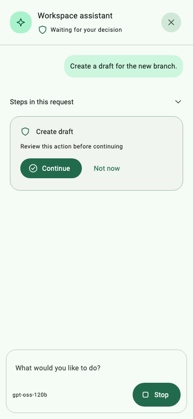
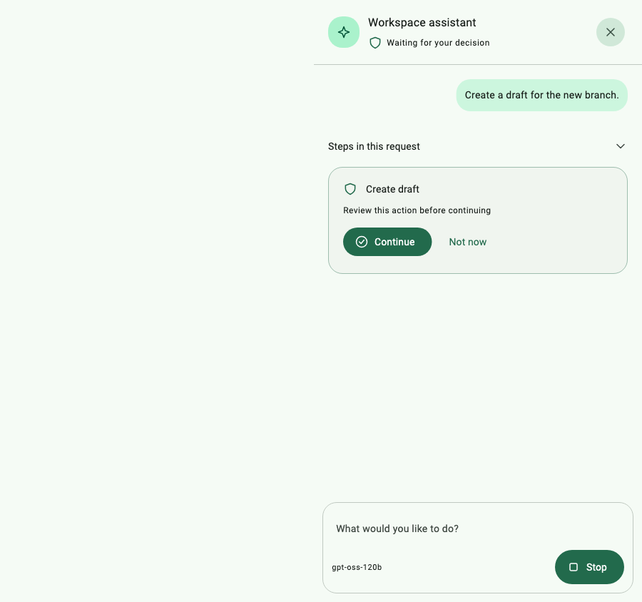

# Chat controls and embedded presentation — 0.3.1

The assistant uses inline SVG glyphs for closing, sending, stopping, statuses,
model selection, tool steps and permission cards. These controls no longer
require a downloaded or cached Material icon font. Host theme colors and the
existing permission, background execution and selectable Markdown behavior remain.

Verification:

- Local pana: **160/160**, all six Flutter platforms supported.
- Publication dry run: zero warnings; `asystant_ai 0.3.1` published to pub.dev.
- Linux Flutter 3.47.5: 37 tests passed, one opt-in live gateway test skipped.
- macOS suite plus narrow/short viewport regression passed; analyzer clean.
- Ready and permission screenshots at widths 390 and 900 deliberately omit
  Material icon font loading; no missing glyphs remain.
- Existing report goldens refreshed on macOS and Linux.

The live provider test remains opt-in and was not executed during this release.
The images below contain fixture data and English text, not production records.

