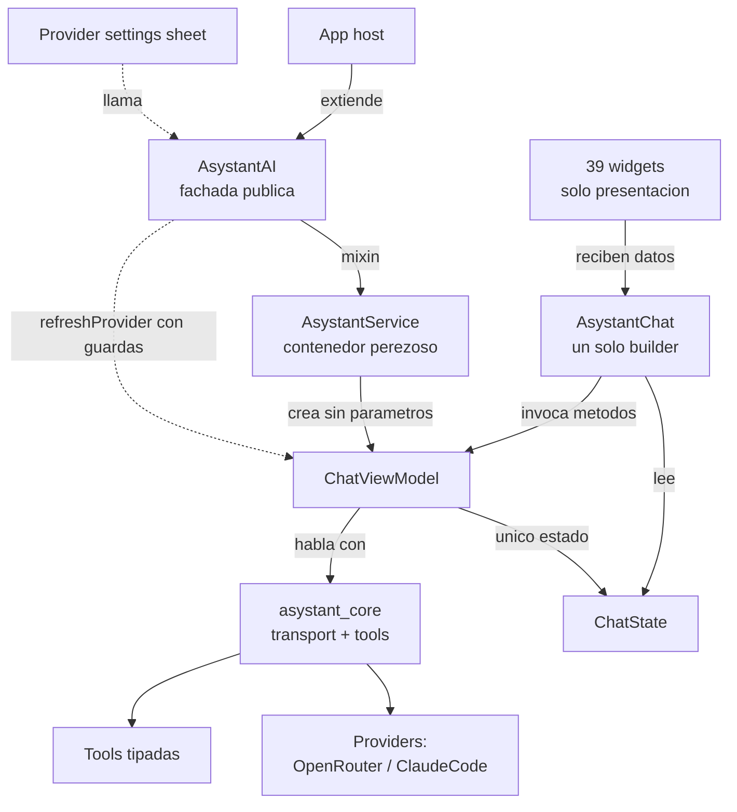
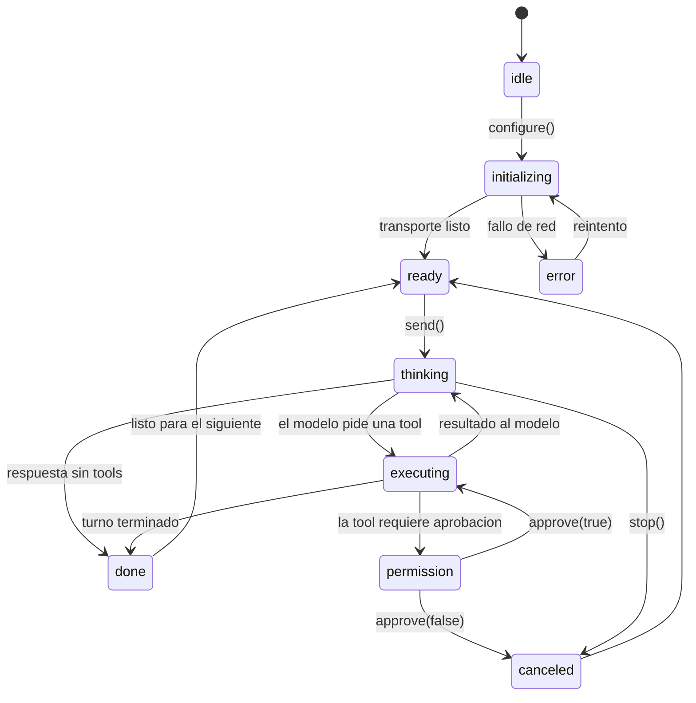

# asystant_ai — architecture

A map for a new contributor. For the full public API, see dartdoc.

## Modules

## State flow

## Layering

- `AsystantAI` is the public facade a host extends. `AsystantService` is the
  mixin that lazily owns one `ChatViewModel` per instance.
- `ChatViewModel` holds the one `ChatState` for a conversation and talks to
  `asystant_core` for transport and tool execution.
- `AsystantChat` is the single `ReactiveViewModelBuilder` of the package: it
  reads `ChatState` and invokes `ChatViewModel` methods. Every other widget
  under `widgets/` is pure presentation — it receives already-derived data
  and renders it, nothing more.

## Rules

- All business logic lives in the `ChatViewModel` (or in the `ChatState`
  getters it exposes) — never in a widget's `build()`. A condition that is
  not strictly visual is in the wrong layer.
- `ChatViewModel` has a zero-parameter constructor. Collaborators are
  resolved inside via `configure(...)`, never injected through the
  constructor.
- One `ReactiveViewModelBuilder` per screen, never nested. `AsystantChat`
  owns the only one in this package.
