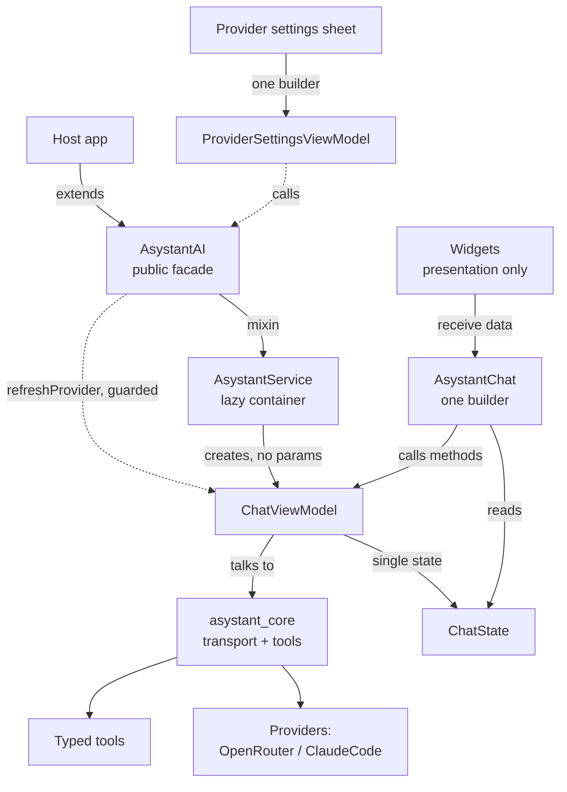
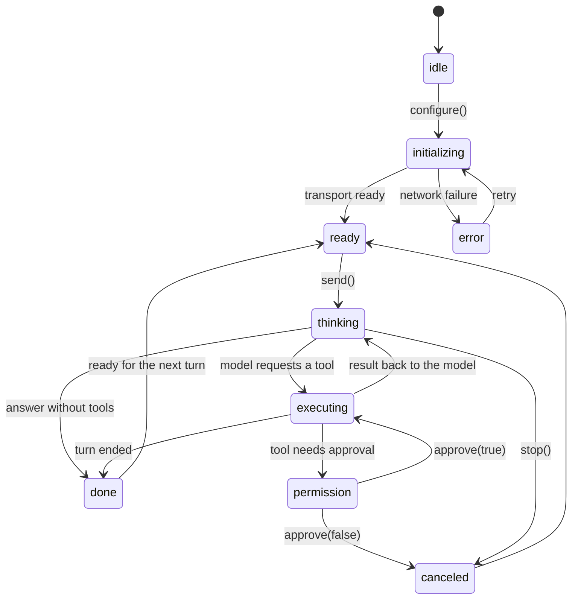

# asystant_ai — architecture

A map for a new contributor. For the full public API, see dartdoc.

## Modules

## State flow

## Layering

- `AsystantAI` is the public facade a host extends. `AsystantService` is the
  mixin that lazily owns one `ChatViewModel` per instance.
- `ChatViewModel` holds the one `ChatState` for a conversation and talks to
  `asystant_core` for transport and tool execution. Its code is split by
  responsibility into five private `part of` mixins, one file each:
  `lifecycle`, `conversations`, `composition`, `turn` and `tools`. Each mixin
  is declared `on` the ones applied before it, and every private member is
  implemented in exactly one of them.
- `ProviderSettingsViewModel` (private, not exported) owns the provider
  settings sheet: loading, validation, saving and key removal. `open()`
  resets it on every opening. The API key is only ever a method argument and
  never part of its state.
- `AsystantChat` is the single `ReactiveViewModelBuilder` of the chat: it
  reads `ChatState` and invokes `ChatViewModel` methods. Every other widget
  under `widgets/` is pure presentation; enum-to-glyph/color mappings live in
  the `*_presentation.dart` extensions.

## Rules

- All business logic lives in a view model or in the `ChatState` getters
  it exposes, never in a widget's `build()`. A condition that is not
  strictly visual is in the wrong layer.
- View models have a zero-parameter constructor. Collaborators arrive
  through a method (`configure(...)`, `open(...)`), never the constructor.
- One reactive builder per screen, never nested.
- Never call `ReactiveNotifier.cleanup()`: it is global and would wipe the
  host's state.
- Deferred design debt is marked in code with `keel-debt:` comments.
