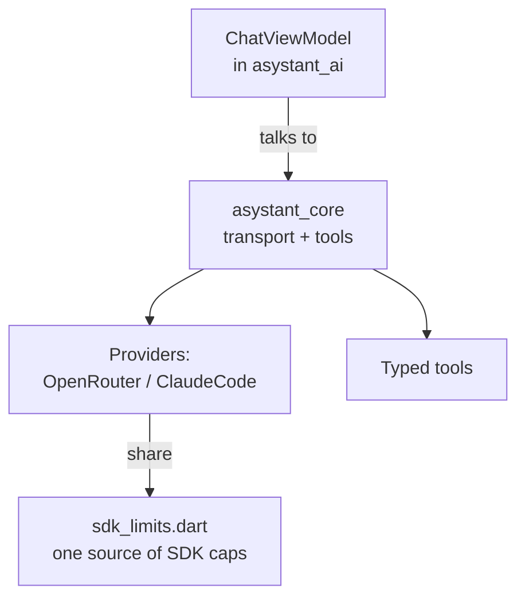

# asystant_core — architecture

A map for a new contributor. For the full public API, see dartdoc.

## Role in the system

`asystant_core` has no UI and no ViewModel: it is the transport and tool
layer that `asystant_ai`'s `ChatViewModel` talks to.

## Layering

- `model/` — immutable, serializable value types shared by transports and
  tools: messages, failures, attachments, tool calls and their JSON
  round-trip. No I/O, no business rules.
- `tool/` — the contract a host implements to expose a local capability to
  the model: `ToolDefinition` (schema), `ToolArguments` (typed JSON
  boundary), `ToolContext` (execution capability: cancellation, progress,
  private input) and `ToolRegistry`/`ToolOutcome`.
- `providers/` — the transports that speak to an actual model (OpenRouter,
  Claude Code), each translating its own wire format into the shared
  `model/` types. No provider detail leaks past this layer.

## Rules

- All business logic lives in transports and tools, never assumed by a
  caller outside this package.
- `Result<T, E>` (`result_controller`) is the error contract across the
  public surface — no exceptions for control flow, except the documented
  `TypeError` thrown by `ToolArguments` accessors on a type mismatch, which
  is a programmer error, not a recoverable one.
- A module does not import back across `model/` ↔ `tool/` without a reason;
  where a cycle exists today it is tracked as debt, not extended further.
